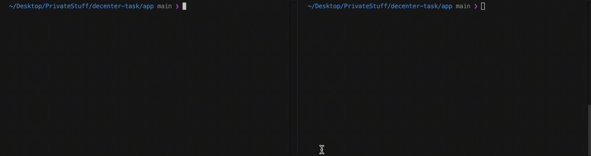

# Decenter Zadatak

## Aplikacija

- Za ovaj zadatak koristio sam Python aplikaciju i kreirao dva endpointa ( /health , /metrics ) 

- Health endpoint vraća JSON sa statusom aplikacije
- Metrics endpoint vraća ukupan broj requestova od kada se pokrene aplikacija

- Aplikaciju mozemo da pokrenemo sledećim komandama:

```bash
cd app

python main.py
```

- Jednostavnom curl komandom možemo da potvrdimo da oba endpoint rade:

```bash
curl http://0.0.0.0:3000/metrics

curl http://0.0.0.0:3000/health
```


- Kao po zahtevu u zadatku aplikacija se pokreće na portu 3000. 

  - External port je trebao biti mapiran na 80. Zbog korišćenja AWS Fargate nije bilo moguće. Container port i external port moraju biti isti. 
  - Ovaj problem je mogao biti rešen postavljanjem ALB ispred našeg ECS servisa.

- Dockerfile je napravljen tako da koristi multi-stage build.
  - Stage 1: Instalira Python pakete iz requirements.txt u privremeni build environment. 
  - Stage 2: Kopira jedino instalirane pakete iz prvog stage-a, kreira non-root usera za security, dodaje kod aplikacije i pokreće FastAPI aplikaciju na portu 3000.
  - Kao po zahtevu dodat je i HEALTHCHECK unutar Dockerfile-a. Ono sto sam primetio jeste da HEALTHCHECK komanda u lokalu kada pokrenem kontejner radi normalno na svakih 30s. Ali unutar ECS ne pokazuje logove za HEALTHCHECK, zato što ECS ima svoj Health check mehanizam. 


## CI/CD

- Trenutni pipeline je konfigurisan tako da može da se pokrene manuelno od strane korisnika, ali se takodje pokreće automatski kada se nešto push-uje na main branch ili merge na main.

- Takodje pošto radimo samo Docker build i push, pipeline se izvršava samo kad su promene napravljene unutar /app direktorijuma.

- Za Docker push korišćen je GHCR. Kreiran je GitHub token koji koristimo za login da bi mogli da push-ujemo Docker image na GHCR. 

- Verzionisanje Docker image je odradjeno preko commit hash-a. Mislim da je ovo mnogo bolja praksa nego korišćenje latest tag-a. 


## Terraform

Terraform konfiguracija za podizanje AWS infrastrukture koja podiže FastAPI Python aplikaciju na AWS ECS Fargate.

Ova Terraform konfiguracija kreira ceo AWS ECS Fargate deployment sa sledećim komponentama:

#### 1. **ECS Cluster**

- Kreira ECS cluster (`decenter-app-cluster`) sa uključenim Container Insight koji služi za dodatni monitoring
- Konfigurisan je za Fargate

#### 2. **Task Definition**
- Task koji definiše funkciju kontejnerizovane aplikacije sa: 
  - CPU: 256 (0.25 vCPU)
  - Memorija: 512 MB
  - Container port: 3000 
  - Environment varijabla `APP_ENV` za runtime konfiguraciju

#### 3. **ECS Service**
- Konfigurisan da pokreće 1 task ( moguće konfigurisati broj taskova pomocu `desired_count` )
- Network je podešen na Public IP adresu da bi bio dostupan external.
- Koristi specificirane VPC subnete i security grupe.


#### 4. **IAM Role i Permisije**
- **CloudWatch Logs**: Dozvoljava da kreira i upisuje logove.
- **ECS Task Execution Role**: Korišćena od strane ECS servisa
- **CloudWatch Logs**: Dozvoljava da kreira i upisuje logove.

#### 5. **CloudWatch Logs**
- Log grupa: `/ecs/decenter-app-cluster/decenter-web-service`
- Period čuvanja: 30 dana ( konfigurabilno )

#### 6. **Tagovanje**
- Svi resursi su tagovani sa  `Name` i `SRE_TASK` tagovima
- `SRE_TASK` tag uključuje moje ime i prezime kao po zahtevu.

## Kako se koristi

#### Korak 1: Updatovanje `terraform.tfvars`

Unutar `terraform.tfvars` možemo da specificiramo vrednosti:

```hcl
cluster_name = "decenter-app-cluster" # Ime clustera
service_name = "decenter-web-service" # Ime servisa

container_name   = "decenter-app" # Ime container-a
container_image  = "ghcr.io/kuzmanikola/decenter-task:latest" # Ime Docker image-a
container_cpu    = 256 # CPU container-a
container_memory = 512 # Memorija container-a
container_port   = 3000 # Container port

desired_count = 1 # Broj taskova u servisu

app_environment = "dev" 

subnets = [
  "subnet-06a0d88a081ef8b8f"  # Subnet ID
]

security_groups = [
  "sg-0bf64e8077ae2608e"  # Security grupa ID
]

assign_public_ip = true # Dodeljivanje public IP adrese

aws_region = "us-east-1" # Region za AWS

log_retention_days = 30 # Period čuvanja logova za CloudWatch

sre_task_owner = "Ime i Prezime" # Služi za tagovanje resursa
```

#### Korak 2: Terraform init

```bash
cd terraform
terraform init
```

Ova komanda preuzima sve potrebne providere i inicijalizuje backend.

#### Korak 3: Plan infrastrukture

```bash
terraform plan -var-file=environments/dev/terraform.tfvars
```

Prikazuje jasan plan svih terraform resursa koji trebaju da se kreiraju.

#### Korak 4: Apply infrastrukture

```bash
terraform apply
```

Terraform apply komanda koristimo da kreiramo resurse na AWS-u

### Pristupanje Outputs

- Ako nismo uradili terraform apply, nećemo moći da izlistamo outputs
```bash
# Izlistavanje svih output-a
terraform output

# Izlistavanje odredjenih output-a
terraform output cluster_arn
```

## Dizajn Odluke

### 1. **Arhitektura Modula**

- Odvojeni su svi ECS resursi unutar `ecs_module` sub-direktorijuma.

- Module moze biti korišten za više servisa sa različitim konfiguracijama.
- Promene za ECS su centralizovane na jednom mestu
- Jednostavno možemo dodati novi servis pozivanjem modula više puta.

```
├── ecs_module                  # ECS module
│   ├── main.tf                 # ECS resursi (cluster, service, task, IAM)
│   ├── outputs.tf              # Module outputs
│   └── variables.tf            # Module input varijable
├── environments                # Direktorijum za odvajanje environmenta
│   └── dev                     # Direktorijum za konfiguraciju Dev Environmenta
│       └── terraform.tfvars    # Vrednost varijabli
├── main.tf                     # Root konfiguracija, poziva ecs_module
├── outputs.tf                  # Root konfiguracija za outpute
├── providers.tf                # AWS provider konfiguracija
└── variables.tf                # Root konfiguracija za podešavanje varijabli.
```

### 2. **Fargate**

- Korišćen je Fargate kao po zahtevu u zadataku. 

- Mislim da je jednostanvije koristiti Fargate jer je serverless. Nema potrebe za podešavanjem EC2 instanci. 
- Prednost Fargate-a je takodje i automatsko skaliranje i brzina deploymenta.

### 4. **CloudWatch Logs sa periodom cuvannja**

- Konfigurisan CloudWatch sa periodom čuvanja od 30 dana.

- CloudWatch nam daje prednost jer su nam logovi centralizovane na jednom mestu. Takodje možemo lako da ih exportujemo na DataDog. 
- Kreirana je i Log Grupa `/ecs/decenter-app-cluster/decenter-web-service`

### 5. **Public IP**

- Koristio sam Public IP da bi aplikacija bila external dostupna.
- Ovo nije best practices zbog security razloga. 

## Problemi & Kako unaprediti aplikaciju

- Zbog zahteva u zadatku da se samo koristi terraform plan, nisam bio siguran da li zapravo konfiguracija radi. 
- Terraform plan moze da prolazi u većini slučajeva ali prilikom apply-a on padne. 
- Da bih bio siguran da zapravo cela konifuracija radi ja sam koristio terraform apply na svom AWS nalogu. 

- Komanda `HEALTHCHECK` vraca svakih 30s health endpoint samo u slučaju kada se Docker pokrene u localu. 
- Da bi radilo unutar ECS potrebno je kreirati ECS Health Check.

- Takodje zahtev zadatka je da aplikacija bude dostupna na portu 80. Korišćenjem ECS-a to nije moguće, container port i external port moraju da budu isti. Dodavanjem ALB ovaj problem bi bio rešen. 

- Da bih bio siguran da ECS i deployment rade kako treba, kreirao sam GitHub Token koji sam sacuvao unutar AWS Secret Managera. Unutar Terraform ECS konfiguracije specificirao sam da koristi taj secret za autentifikaciju na GitHub Container Registry, radi povlačenja image-a.

  ```hcl
  resource "aws_secretsmanager_secret" "ghcr_token" {
    name        = "${var.cluster_name}-${var.service_name}-ghcr-token"
    description = "GitHub Container Registry personal access token for pulling images"

    tags = {
      Name     = "${var.cluster_name}-${var.service_name}-ghcr-token"
      SRE_TASK = var.sre_task_owner
    }
  }

  resource "aws_secretsmanager_secret_version" "ghcr_token" {
    secret_id     = aws_secretsmanager_secret.ghcr_token.id
    secret_string = jsonencode({
      username = "USERNAME"
      password = "PLACEHOLDER_TOKEN"
    })
  }
  ```

- Verzionisanje Docker Image-a je odradjeno tako da svaki put kada se promeni nešto u aplikaciji ili unutar Dockerfila i kada se to commit-uje, pipeline će kreirati novi Docker image i dodati mu tag tog commit hash-a.

- Zahtev zadatka je bio da image u ECS-u bude konfigurabilan što je i odradjeno. Medjutim korišćenjem image name-a unutar terraform.tfvars nailazimo na problem da svaki put kada se odradi terraform apply ECS će da prepisuje image koji se koristi u terraform.tfvars-u.

- Ovaj problem bih resio tako sto bih `container_image` napravio kao optional varijablu. Image bih samo specificirao unutar GitHub Actions i deploy bi radio kroz GitHub Actions koristeci AWS CLI. Tad bi bili sigurni da ECS uvek koristi poslednji image koji je commit-ovan.

  ```yaml
  - name: Deploy to ECS
          run: |
            TASK_DEFINITION=$(aws ecs describe-task-definition --task-definition decenter-app-cluster-decenter-web-service)
            NEW_TASK_DEF=$(echo $TASK_DEFINITION | jq --arg IMAGE "$IMAGE_TAG" '.taskDefinition | .containerDefinitions[0].image = $IMAGE | del(.taskDefinitionArn, .revision, .status, .requiresAttributes, .compatibilities, .registeredAt, .registeredBy)')
            NEW_TASK_INFO=$(aws ecs register-task-definition --cli-input-json "$NEW_TASK_DEF")
            NEW_REVISION=$(echo $NEW_TASK_INFO | jq -r '.taskDefinition.revision')
            
            aws ecs update-service \
              --cluster decenter-app-cluster \
              --service decenter-web-service \
              --task-definition decenter-app-cluster-decenter-web-service:$NEW_REVISION \
              --force-new-deployment
  ```

- Pokušavajući da odradim curl na public IP od mog servisa dobijao sam timeout. Problem je bio security grupa koja je omogućavala komunikaciju servisa samo unutar te security grupe. Kreiranjem outbound rules dozvolio sam da moze da se pristupi sa `0.0.0.0/0` i postavio sam port range `3000`.

- Zadatak bih unapredio jos koristeći S3 bucket za skladištenje Terraform remote state-a. Takodje bih korstio DynamoDB za state lock. 
Primer: 

  ```hcl
  terraform {
    backend "s3" {
      bucket         = "terraform-state-bucket"
      key            = "decenter-app/terraform.tfstate"
      region         = "us-east-1"
      encrypt        = true
      dynamodb_table = "terraform-state-lock"
    }
  }
  ```

- Takodje bih kreirao GitHub Actions za Infrastrukturu. Terraform init, plan i apply mogu biti automatizovani preko pipeline-a. Cilj je da se nista ne pokreće manuelno ili u lokalu. 

- Aplikaciju smo mogli da smestimo takodje u private subnet. Zatim korišćenjem NAT gateway-a bi mogli aplikaciji da omogućimo outbound internet pristup. 

- Dodatne Security grupe mozemo da kreiramo i da dozvolimo traffic samo od Load Balancer-a ili specificne IP adrese.

### Obavezne varijable

| Variable | Type | Description | Example |
|----------|------|-------------|---------|
| `cluster_name` | string | ECS cluster ime | `decenter-app-cluster` |
| `service_name` | string | ECS service ime | `decenter-web-service` |
| `container_name` | string | Kontejner ime u task-u | `decenter-app` |
| `container_image` | string | Docker image | `ghcr.io/user/repo:tag` |
| `container_cpu` | number | CPU (256 = 0.25 vCPU) | `256` |
| `container_memory` | number | Memory u MB | `512` |
| `subnets` | list(string) | Subnet IDs za task | `["subnet-abc123"]` |
| `security_groups` | list(string) | Security grupa IDs | `["sg-abc123"]` |
| `sre_task_owner` | string | Ime i prezime za tagovanje | `"Nikola Kuzman"` |

### Opcione Varijable

| Variable | Type | Default | Description |
|----------|------|---------|-------------|
| `container_port` | number | `80` | External port |
| `desired_count` | number | `1` | Broj taskova za pokretanje |
| `app_environment` | string | `"dev"` | APP_ENV environment varijabla |
| `assign_public_ip` | bool | `true` | Dodeljivanje Public IP adrese |
| `aws_region` | string | `"us-east-1"` | AWS region |
| `log_retention_days` | number | `7` | CloudWatch log period zadrzavanja |
